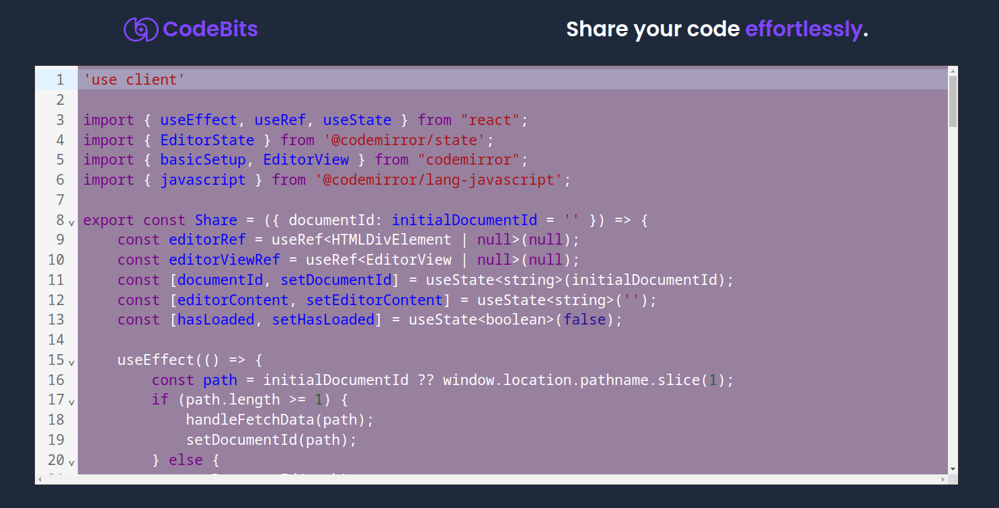

# CodeBits
Efficient and Effortless code sharing application. `Fun Kitty Project`



## Tech Stack
- Next js
- PostgreSQL
- [codemirror](https://www.npmjs.com/package/codemirror) 


## Run Locally

Clone the project

```sh
$ git clone https://github.com/ppriyankuu/code-bits
```

Go to the project directory

```sh
$ cd code-bits
```

Install dependencies

```sh
$ npm install
```

Migrate the database
```sh
$ npx prisma migrate dev
```

Start the server
```sh
$ npm run dev
```


## Author
- [@Priyanku Gogoi](https://github.com/ppriyankuu)